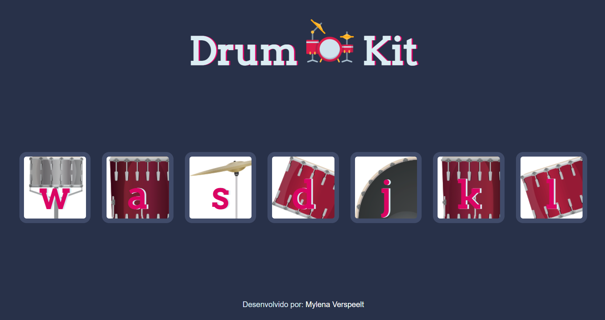

# Drum-Kit

Drum set made with vanilla JS! Use your keyboard to play drums!

To check the page just click on the link: https://mylenaverspeelt.github.io/Drum-Kit/

<h3 align="left">Tech Stacks & Tools</h3>
    

    
    
    
    

 

 

Developed by: Mylena Verspeelt 🦜

<a href="https://www.linkedin.com/in/mylenaverspeelt" target="_blank">LinkedIn</a>

 

